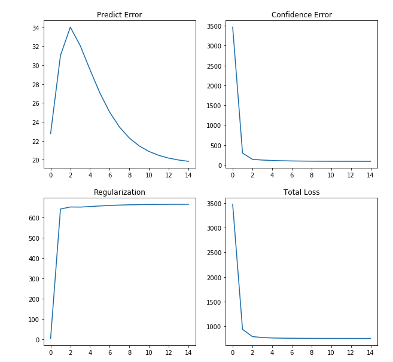

## ALS_implementation
Implementation of ALS algorithm from "Collaborative Filtering for Implicit Feedback Data" [[paper]](http://yifanhu.net/PUB/cf.pdf)  

## Contents
- als.ipynb : notebook which contains step by step comments and visulization.
- als.py : simplified python implementation

## Parameters to fix
- r_lambda = 40
- nf = 200
- alpha = 40

## Train Result
</img>

## More detail
- als.ipynb contains details of each algorithm steps.
- more information can be found in my blog posting. (in Korean) [[blog]](https://yeomko.tistory.com/8) 

